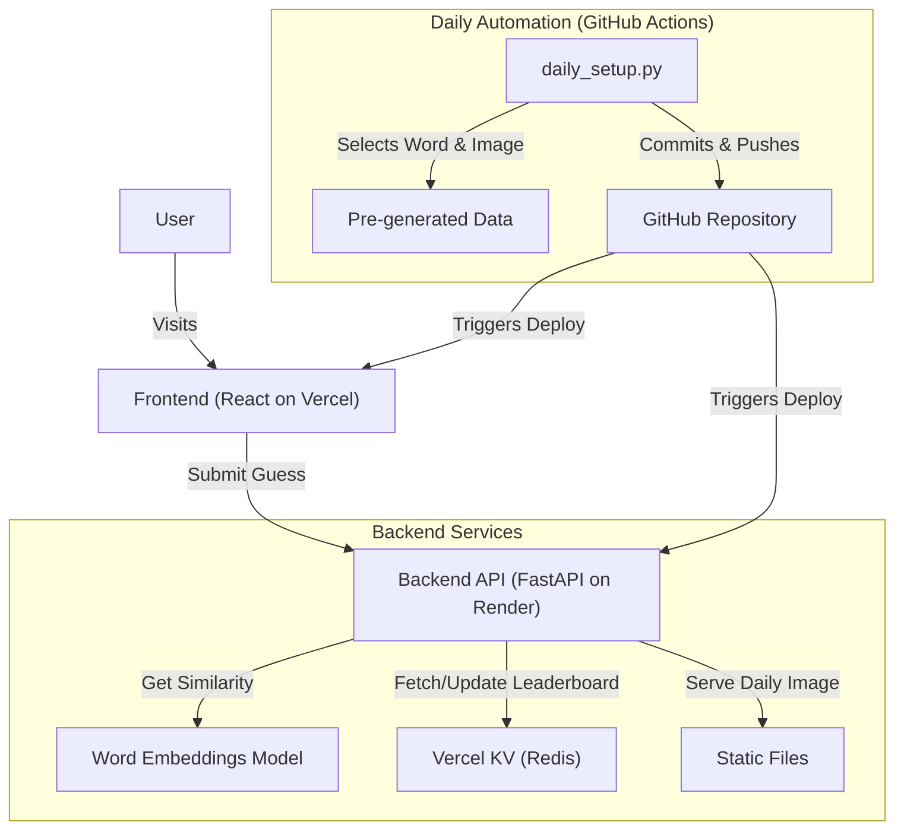

# Pixelo

**Pixelo** is a daily AI-powered drawing guessing game. It combines the fun of Pictionary with the challenge of semantic word guessing games like Semantle.

## 🎮 How to Play

1.  **Analyze the Doodle**: Every day, a new AI-generated doodle is presented. The doodle represents a specific secret word.
2.  **Make a Guess**: Type your guess into the input box.
3.  **Check the Feedback**:
    *   **Green**: You are very close semantically! (e.g., "Dog" vs "Puppy")
    *   **Yellow**: You are on the right track.
    *   **Red**: You are far off.
4.  **Win**: Guess the exact word to win and see your rank on the daily leaderboard!

## 🧠 How it Works

Pixelo is built on two core AI technologies:

1.  **AI Image Generation**: The daily doodles are generated using **Stable Diffusion** (or similar diffusion models) with a specific "bad drawing" or "scribble" prompt style to mimic human sketches.
2.  **Semantic Similarity**: When you make a guess, the game calculates the **Cosine Similarity** between your guess and the secret word using pre-trained word embeddings (e.g., Word2Vec or GloVe). This allows the game to tell you how "close" your meaning is, even if the words are spelled differently.

## 🏗️ System Architecture

The project is designed to be fully automated and scalable.

### Components

*   **Frontend**: Built with **React**, hosted on **Vercel**. It handles the game UI, user interactions, and communicates with the backend.
*   **Backend**: Built with **FastAPI (Python)**, hosted on **Render**. It handles the game logic, similarity calculations, and leaderboard management.
*   **Database**: **Vercel KV (Redis)** is used to store the daily leaderboard and game state.
*   **Automation**: **GitHub Actions** runs a daily script (`daily_setup.py`) at midnight UTC. This script:
    1.  Selects the next pre-generated word/image pair.
    2.  Updates the active game files in the repository.
    3.  Commits and pushes the changes.
    4.  Triggers a fresh deployment to ensure the new daily game is live.

## 🛠️ Tech Stack

*   **Frontend**: React, CSS3
*   **Backend**: Python, FastAPI, NumPy, Scikit-learn
*   **Data**: Pre-trained Word Embeddings (GloVe/Word2Vec)
*   **Infrastructure**: Vercel (Frontend & KV), Render (Backend), GitHub Actions (Automation)
